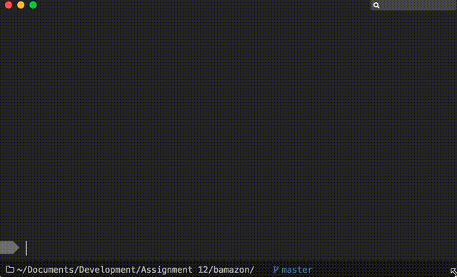
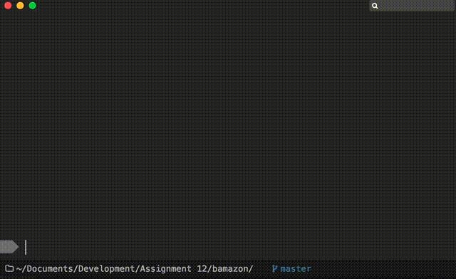

# Bamazon: A CLI Retail Application
This is a simple retail application run from the command line. It connects to
a localhost database that holds products. There are two separate interfaces for
the application. The customer application allows the user to order items.
The manager application allows the the user to view products, view low
inventory products, add to a product's inventory, and add a new product.

## Customer Application

The bamazoncustomer.js file is the customer application.

## Manager Application

The bamazonManager.js file is the manager application.

## Full Video Walkthroughs
<a href="assets/images/fullcustomer.mov">Full Customer Walkthrough</a>
<a href="assets/images/fullmanager.mov">Full Manager Walkthrough</a>

## Authors
Daniel Sullivan